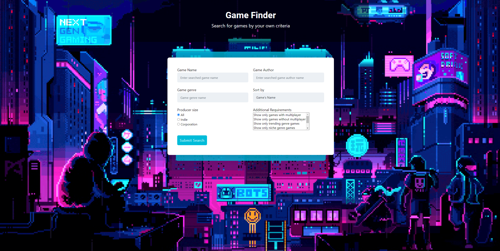
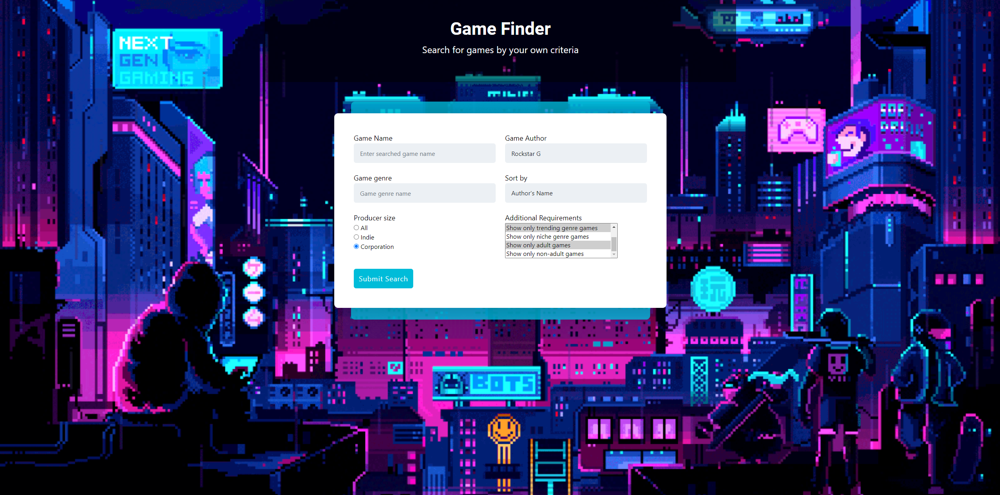
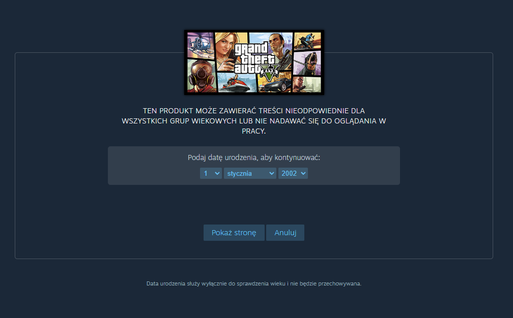

# Java Servlet Application

This is a simple Java Servlet application that uses a PostgreSQL database to store and retrieve data.

## How to run?

1. Prepare maven dependencies
```
mvn clean install
```
2. Install and configure GlassFish server
3. (install Docker if not installed) Create a docker image based PostgreSQL database
```
docker run --name some-postgres -e POSTGRES_PASSWORD=<your password> -d -p 5432:5432 postgres
```
4. Run SQL scripts from [src/main/resources/Sql/CREATE.sql](./src/main/resources/Sql/CREATE.sql) on the database.
5. Run the application

You're all set!

## Screenshots

(note: the screenshots may vary from the current state of the application)




(result of clicking on the "FIND ON STEAM" button)

(query result without any filters on)


